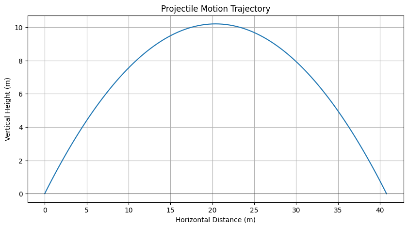

# 📘 Problem 1: Projectile Motion

**Objective:**
Understand the motion of a projectile launched at an angle and derive equations to describe its trajectory.

---

## 🧠 What is Projectile Motion?

Projectile motion describes the motion of an object that is launched into the air and moves under the influence of gravity alone. It follows a **parabolic** path and can be broken down into two **independent components**:

* **Horizontal (x-axis)**
* **Vertical (y-axis)**

---

## 1️⃣ Horizontal Motion (x-direction)

* There is **no horizontal acceleration** (air resistance is ignored).

* Horizontal velocity remains **constant**:

  $$
  v_x = v_0 \cos(\theta)
  $$

* Horizontal displacement (distance covered in x-direction):

  $$
  x = v_0 \cos(\theta) \cdot t
  $$

---

## 2️⃣ Vertical Motion (y-direction)

* Affected by **gravitational acceleration** $g = 9.8 \, \text{m/s}^2$

* Vertical velocity at any time $t$:

  $$
  v_y = v_0 \sin(\theta) - g t
  $$

* Vertical displacement:

  $$
  y = v_0 \sin(\theta) \cdot t - \frac{1}{2} g t^2
  $$

* **Time to reach maximum height** (when $v_y = 0$):

  $$
  t_{\text{max}} = \frac{v_0 \sin(\theta)}{g}
  $$

* **Maximum height** reached:

  $$
  H = \frac{(v_0 \sin(\theta))^2}{2g}
  $$

---

## 3️⃣ Total Time of Flight

If the projectile **returns to the same height** it was launched from:

$$
T = \frac{2 v_0 \sin(\theta)}{g}
$$

---

## 4️⃣ Range of the Projectile

The **horizontal distance** the projectile travels before hitting the ground:

$$
R = \frac{v_0^2 \sin(2\theta)}{g}
$$

---

## ✅ Summary of Key Variables

| Symbol   | Meaning                                |
| -------- | -------------------------------------- |
| $v_0$    | Initial velocity                       |
| $\theta$ | Launch angle                           |
| $g$      | Acceleration due to gravity (9.8 m/s²) |
| $t$      | Time                                   |
| $x, y$   | Position coordinates                   |
| $H$      | Maximum height                         |
| $R$      | Range (horizontal distance)            |

---

## 📌 Applications

Projectile motion is commonly used in:

* Sports (e.g. calculating ball trajectory)
* Engineering (e.g. launching projectiles)
* Video games (e.g. simulating realistic physics)

---

## 🖼️ Diagram

### Figure: Projectile Motion Trajectory

This graph shows the trajectory of a projectile launched with an initial speed of 20 m/s at an angle of 45° above the horizontal. The horizontal axis represents the horizontal distance in meters, and the vertical axis shows the vertical height in meters.

The projectile follows a parabolic path: it rises due to the vertical component of the velocity, reaches a maximum height of approximately 10.2 meters, and then falls back to the ground. The total horizontal range is about 40.8 meters, and the motion is symmetric about the peak. This trajectory results from the constant horizontal velocity and the vertical acceleration due to gravity
$g = 9.8\, \mathrm{m/s}^2$
