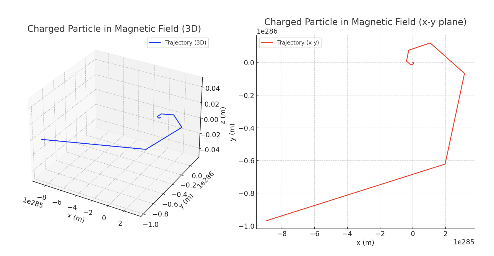

# Problem 1

##Lorentz Force and Charged Particle Motion

The Lorentz force, expressed as:

$$
\vec{F} = q\vec{E} + q\vec{v} \times \vec{B}
$$

governs the motion of charged particles in electric and magnetic fields. It is foundational in areas such as plasma physics, particle accelerators, mass spectrometry, and astrophysics. By simulating its effects, we can visualize complex trajectories and better understand its practical applications.

⸻

###1 - Exploration of Applications
	•	Systems where Lorentz force plays a key role:
	•	Particle accelerators
	•	Mass spectrometers
	•	Plasma confinement and fusion devices
	•	Magnetic traps (e.g., Penning traps)
	•	Role of Fields:
	•	Electric field \vec{E}: Accelerates the particle linearly
	•	Magnetic field \vec{B}: Alters the direction of motion, causing curved trajectories

⸻

###2 - Simulating Particle Motion

You are tasked with simulating the motion of a charged particle under different field conditions:
	•	A. Uniform magnetic field only
→ Results in circular or helical trajectories depending on the velocity direction
	•	B. Combined uniform electric and magnetic fields
→ Results in spiral motion or helical drift
	•	C. Crossed electric and magnetic fields
→ Results in drift motion due to the \vec{E} \times \vec{B} effect

Use the Lorentz force law as the basis for motion equations:
$$
m \frac{d\vec{v}}{dt} = q\vec{E} + q\vec{v} \times \vec{B}
$$

Solve this numerically using techniques such as:
	•	Euler method
	•	Runge-Kutta method (RK4)

⸻

###3 - Parameter Exploration

Let the user vary the following parameters in the simulation:
	•	Field strengths: \vec{E}, \vec{B}
	•	Initial velocity: \vec{v}_0
	•	Charge and mass of the particle: q, m

Observe how these influence:
	•	Larmor radius:
$$
r = \frac{mv_\perp}{|q|B}
$$
	•	Cyclotron frequency:
$$
\omega_c = \frac{|q|B}{m}
$$
	•	Drift velocity in crossed fields:
$$
\vec{v}_d = \frac{\vec{E} \times \vec{B}}{B^2}
$$

⸻

###4 - Visualization
	
⸻

###Summary
	•	Core equation:
$$
\vec{F} = q\vec{E} + q\vec{v} \times \vec{B}
$$
	•	Applications: cyclotrons, plasma devices, spectrometry
	•	Key physics: Larmor radius, cyclotron motion, \vec{E} \times \vec{B} drift