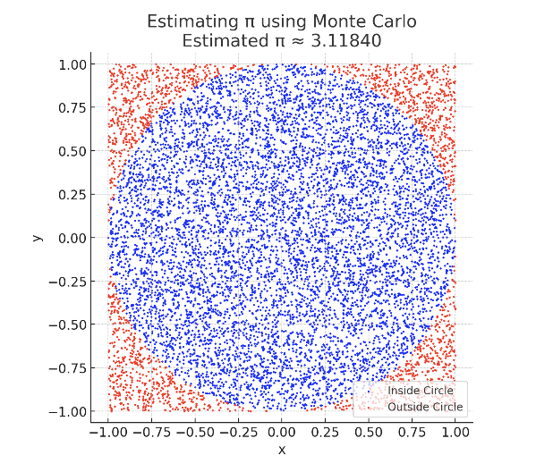

# 📘 Problem 2: Estimating π Using Monte Carlo Methods

Objective:
Understand how to estimate the value of \pi using Monte Carlo simulations — a computational technique that relies on randomness and geometric probability.

---

## 🧠 What Are Monte Carlo Methods?

Monte Carlo methods are a class of computational algorithms that use random sampling to estimate mathematical values. One of the simplest and most visual examples is estimating \pi by randomly generating points inside a square and determining how many fall inside an inscribed circle.

This approach connects geometry, probability, and computation, and provides a hands-on way to explore the power of randomness in problem-solving.

---

## 1️⃣ Estimating π Using a Circle

We consider a unit circle inscribed in a square with side length 2. The idea is:
	•	The area of the circle is \pi r^2 = \pi, since r = 1
	•	The area of the square is 4 (since side = 2)
	•	The ratio of the circle’s area to the square’s area is:
$$
\frac{\text{Area of Circle}}{\text{Area of Square}} = \frac{\pi}{4}
$$

Thus, if we randomly scatter points in the square, the fraction that lands inside the circle should approximate:

$$
\frac{\text{Points inside circle}}{\text{Total points}} \approx \frac{\pi}{4}
$$

So we estimate:

$$
\pi \approx 4 \cdot \frac{\text{Points inside}}{\text{Total points}}
$$

---

## 2️⃣ Simulation Steps

To simulate this in practice:
	•	Generate random points (x, y) in a square from -1 to 1
	•	Check if the point lies inside the unit circle:
$$
x^2 + y^2 \leq 1
$$
	•	Count how many points fall inside the circle
	•	Use the formula to estimate \pi

---

## 3️⃣ Visualization

You can visualize the result by plotting the randomly generated points:
	•	Points inside the circle: typically colored blue
	•	Points outside the circle: typically colored red

This plot visually shows how the estimate becomes more accurate as the number of points increases.

---

## 4️⃣ Buffon’s Needle (Advanced Extension)

Another classic Monte Carlo method for estimating \pi is Buffon’s Needle. In this experiment:
	•	Drop a needle of length l on a plane with parallel lines spaced a distance d apart.
	•	The probability of the needle crossing a line depends on the angle and position.
	•	The formula to estimate \pi is:
$$
\pi \approx \frac{2 \cdot l \cdot \text{(number of throws)}}{d \cdot \text{(number of crosses)}}
$$

This method requires simulating both the angle and position of the needle for each drop.

---

## ✅ Summary of Key Concepts

Concept	Formula / Description
Circle-based estimation	

$$
\pi \approx 4 \cdot \frac{\text{inside}}{\text{total}}
$$
Buffon’s Needle estimation	\pi \approx \frac{2lN}{dC}, 
$$
where C is number of crosses
Point inside circle condition
$$
	x^2 + y^2 \leq 1
$$
Monte Carlo idea	Use randomness to estimate deterministic quantities

---

## 📌 Applications

Monte Carlo methods are used in:
	•	Statistical sampling and simulations
	•	Computational physics and chemistry
	•	Financial risk modeling
	•	Computer graphics and gaming
	•	Numerical integration and probabilistic estimation

---

## 🖼️ Diagram

Figure: Estimating π with Random Points

In this diagram, we simulate 10,000 random points within a square. Points inside the circle are shown in blue, and those outside in red. As more points are added, the ratio of inside-to-total approaches $$\pi/4$$ allowing us to estimate $$\pi$$ with increasing accuracy.