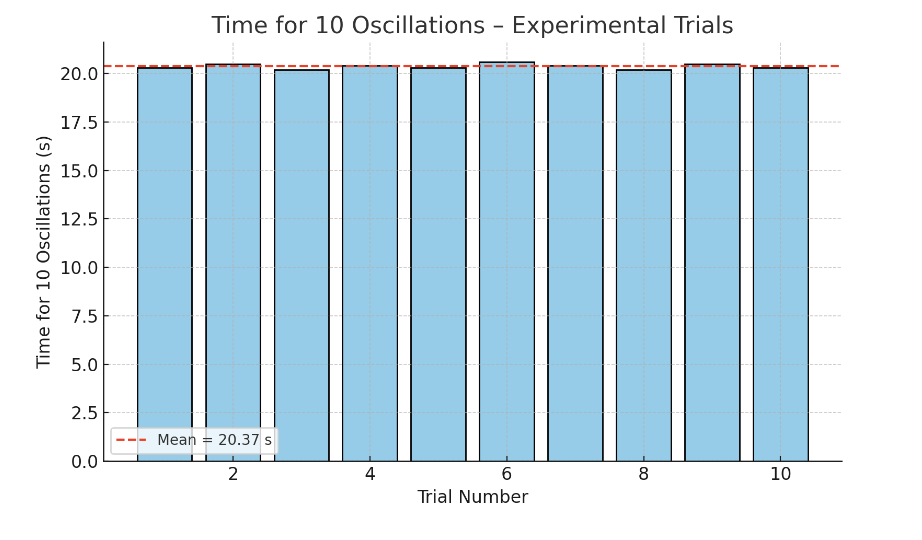

# 📘 Problem 1: Measuring Earth’s Gravitational Acceleration with a Pendulum

## Objective:
Measure the gravitational acceleration g using a simple pendulum, analyze the results, and evaluate the uncertainties in both time and length measurements.

⸻

## 🧠 What Is Gravitational Acceleration?

The acceleration due to gravity g is a fundamental constant that determines how objects fall. Its approximate standard value near Earth’s surface is:

$$
g \approx 9.81 , \text{m/s}^2
$$

A classic method for measuring g is through the oscillations of a pendulum, where the period depends on the pendulum’s length and the local gravitational field.

⸻

## 1️⃣ Materials Needed
	•	A string (1.0 to 1.5 meters long)
	•	A small mass (e.g., keychain, bag of coins, sugar bag)
	•	Stopwatch or smartphone timer
	•	Ruler or measuring tape

⸻

## 2️⃣ Experimental Setup
	•	Attach the mass securely to one end of the string
	•	Measure the pendulum length L from the suspension point to the center of the mass
	•	Record the resolution of your measuring tool and estimate the uncertainty in length:

$$
\Delta L = \frac{\text{Ruler Resolution}}{2}
$$

⸻

## 3️⃣ Data Collection
	•	Pull the pendulum slightly (<15°) and release it smoothly
	•	Measure the time T_{10} for 10 full oscillations
	•	Repeat this 10 times and record all values
	•	Calculate:
	•	The mean time \overline{T}_{10}
	•	The standard deviation \sigma_T
	•	The uncertainty in the mean:
$$
\Delta T_{10} = \frac{\sigma_T}{\sqrt{n}}, \quad n = 10
$$

⸻

## 4️⃣ Calculations

⏱️ Period of One Oscillation

From the average of 10 oscillations:

$$
T = \frac{\overline{T}{10}}{10}, \quad \Delta T = \frac{\Delta T{10}}{10}
$$

⸻

## 🌍 Determine g

Use the formula for the period of a pendulum:

$$
g = \frac{4\pi^2 L}{T^2}
$$

⸻

📉 Propagate Uncertainty in g

Apply error propagation to calculate \Delta g:

$$
\Delta g = g \cdot \sqrt{\left(\frac{\Delta L}{L}\right)^2 + \left(2 \cdot \frac{\Delta T}{T}\right)^2}
$$

⸻

✅ Summary of Key Quantities

Symbol	Meaning
L	Pendulum length
\Delta L	Uncertainty in length
T_{10}	Time for 10 oscillations
\overline{T}_{10}	Mean of 10 measurements
\sigma_T	Standard deviation of time
\Delta T_{10}	Uncertainty in mean time
g	Calculated gravitational acceleration
\Delta g	Uncertainty in g
 
 📊 Figure: Time for 10 Oscillations – Experimental Trials

This bar chart shows the time recorded for 10 full pendulum oscillations across 10 trials. The red dashed line represents the mean value, approximately 20.37 seconds in this dataset.

Even though each individual measurement slightly varies due to timing inconsistencies and human reaction time, the mean provides a stable estimate used for calculating the period and ultimately the gravitational acceleration g